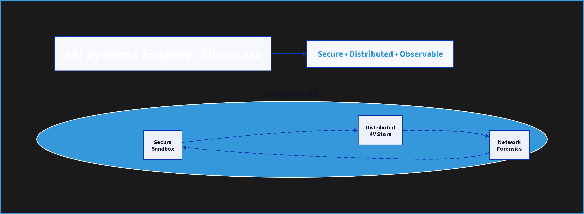
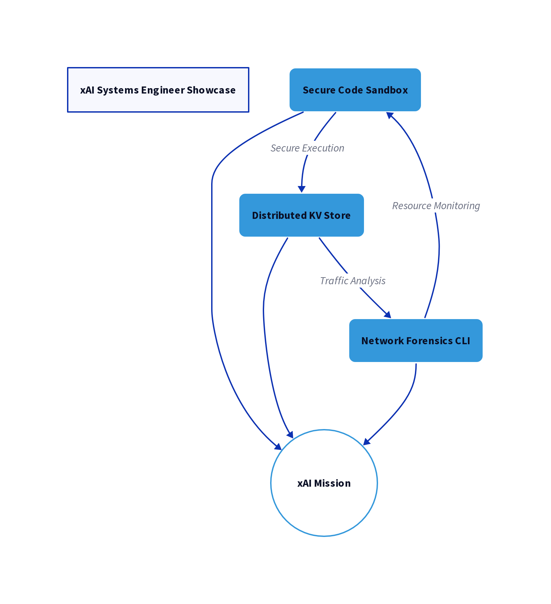

# xAI Systems Engineer Showcase



A comprehensive demonstration of systems engineering expertise through three interconnected Rust-based tools designed for security, reliability, and observability.

[](./LICENSE)
[](https://www.rust-lang.org/)
[](https://github.com/topics/security)

## Project Overview

This repository showcases advanced systems engineering capabilities through three integrated components, each addressing critical aspects of modern distributed systems:

1. **[Secure Code Sandbox](./sandbox/)**: A Rust-based sandbox for executing untrusted Python code in an isolated environment. It leverages Linux namespaces, cgroups, and seccomp to provide process, file, and network isolation, as well as resource limiting.

2. **[Distributed Key-Value Store](./distributed_kv/)**: A lightweight, fault-tolerant, distributed key-value store built in Rust. It uses the Raft consensus algorithm for data replication and consistency, ensuring reliability even when nodes fail.

3. **[Network Forensics CLI](./net_forensics/)**: A command-line tool for capturing and analyzing network traffic. It can parse various protocols and generate visualizations of the network data, providing deep insights into system behavior.

These tools are designed to work together, demonstrating a holistic approach to building and securing complex systems.

## Architecture

The project implements several advanced architectural patterns:

- **Process Isolation**: Using Linux namespaces and bubblewrap for secure execution environments
- **Consensus Algorithms**: Implementing Raft for distributed state management
- **Protocol Buffers & gRPC**: For efficient, type-safe communication
- **Resource Monitoring**: Real-time tracking of CPU and memory usage
- **Data Visualization**: Interactive charts and graphs for system metrics



## xAI Mission Alignment

I am deeply inspired by xAI's mission to "understand the true nature of the universe." This project aligns with that mission by demonstrating the technical foundation needed to build secure, reliable systems that can support advanced AI research and deployment.

The focus on security, reliability, and observability directly supports xAI's need for robust infrastructure to power its ambitious AI research goals.

## Project Structure

```
/xai_showcase
├── sandbox/               # Secure code execution environment
│   ├── src/               # Rust source code
│   ├── Cargo.toml         # Dependencies and build configuration
│   └── README.md          # Component documentation
├── distributed_kv/        # Distributed key-value store
│   ├── src/               # Rust source code
│   │   ├── bin/           # Binary executables
│   │   └── raft/          # Consensus implementation
│   ├── Cargo.toml         # Dependencies and build configuration
│   └── README.md          # Component documentation
├── net_forensics/         # Network analysis tool
│   ├── src/               # Rust source code
│   ├── Cargo.toml         # Dependencies and build configuration
│   └── README.md          # Component documentation
├── docs/                  # Documentation and diagrams
│   └── images/            # Architecture diagrams and screenshots
└── README.md              # Main project documentation
```

## Getting Started

### Prerequisites

* Rust (latest stable version)
* Cargo
* `build-essential` (or equivalent for your distribution)
* `libpcap-dev`
* `protobuf-compiler`
* `bubblewrap`

### Installation

1. Clone the repository:
   ```bash
   git clone https://github.com/yourusername/xai_showcase.git
   cd xai_showcase
   ```

2. Build all components:
   ```bash
   for dir in sandbox distributed_kv net_forensics; do (cd "$dir" && cargo build); done
   ```

### Running the Tools

Detailed instructions for running each tool can be found in their respective README files:

* [Secure Code Sandbox](./sandbox/README.md)
* [Distributed Key-Value Store](./distributed_kv/README.md)
* [Network Forensics CLI](./net_forensics/README.md)

## Key Features

- **Security**: Process isolation, network restrictions, and resource limits
- **Reliability**: Fault-tolerant distributed systems with consensus algorithms
- **Observability**: Real-time monitoring and visualization of system behavior
- **Performance**: Efficient, low-overhead implementations in Rust
- **Extensibility**: Modular design allowing for easy integration with other systems

## Contributing

This is a personal project, but I welcome any feedback or suggestions. Please feel free to open an issue or a pull request.

## License

This project is licensed under the MIT License - see the [LICENSE](./LICENSE) file for details.

## Acknowledgments

- The Rust community for creating an exceptional systems programming language
- The authors of the various libraries and tools used in this project
- xAI for inspiring this showcase with their ambitious mission
