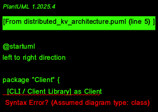

# Distributed Key-Value Store



A fault-tolerant, distributed key-value store built in Rust with consensus-based replication for high availability and data consistency.

## Overview

This distributed key-value store provides a reliable and consistent data storage solution that can withstand node failures. It implements the Raft consensus algorithm to ensure that data remains consistent across all nodes in the cluster, even in the presence of network partitions or node failures.

## Key Features

- **Fault Tolerance:** Continues operating even when nodes fail
- **Strong Consistency:** Uses Raft consensus to ensure data consistency
- **High Availability:** Replicates data across multiple nodes
- **Efficient Communication:** Uses gRPC and Protocol Buffers for fast, type-safe communication
- **Interactive GUI:** Provides a simple interface for interacting with the store

## Architecture

The system consists of the following components:

1. **Cluster Nodes:** Multiple instances that form the distributed system
2. **Raft Consensus Module:** Handles leader election and log replication
3. **Storage Engine:** Manages the actual key-value data
4. **gRPC Server:** Provides the API for clients to interact with the store
5. **GUI Client:** A graphical interface for easy interaction with the store

## Technical Implementation

- **Consensus Protocol:** Raft algorithm for leader election and log replication
- **Communication:** gRPC with Protocol Buffers for efficient serialization
- **State Management:** In-memory state with log-based persistence
- **User Interface:** Built with egui/eframe for a native look and feel

## Usage

### Starting a Cluster Node

To start a node in the cluster:

```bash
./target/debug/distributed_kv
```

By default, the node will listen on port 50051 for client connections and use ports 50052+ for inter-node communication.

### Using the GUI Client

A graphical client is provided for easy interaction with the store:

```bash
cargo run --bin gui
```

This will open a window where you can:
- **Get:** Retrieve values by key
- **Set:** Store new key-value pairs
- **Delete:** Remove keys from the store

### API Operations

The store supports the following operations:

- **Get:** Retrieve a value by its key
- **Set:** Store a key-value pair
- **Delete:** Remove a key-value pair
- **List:** Enumerate all keys in the store

## Performance Considerations

The distributed nature of the system introduces some trade-offs:

- **Latency:** Write operations require consensus among a majority of nodes
- **Throughput:** Limited by the leader's capacity to process requests
- **Consistency vs. Availability:** The system prioritizes consistency over availability (CP in CAP theorem)

## Future Enhancements

- Add support for transactions across multiple keys
- Implement snapshotting for faster node recovery
- Add authentication and authorization
- Support for watch operations (notifications on key changes)
- Cluster membership changes without downtime
